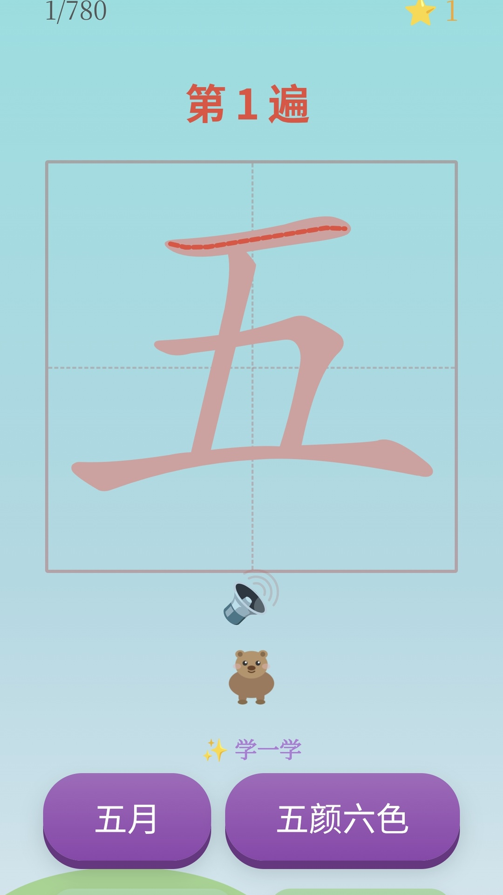

# 宝宝识字 — 一年级汉字描红练习

专为幼小衔接和一年级孩子设计的汉字描红练习 App（作者的小孩马上小学了，对汉字的书写规范和笔画顺序一窍不通，幼儿园又不教，可能小学也不会教，老父亲不得已vibe了一个练习应用）

## 功能

- 780 个汉字，按人教版一年级教材生字表顺序
- 用触屏的方式在田字格逐笔描红，实时笔画判定
- 用中学的强化记忆法，三遍渐进练习：熟悉 → 巩固 → 提高
- 每个汉字配标准读音 + 组词
- 内置 2000+ 词语配音频
- 错题本自动记录易错字
- 完全离线，无广告无联网无收费

## 下载

[👉 下载 APK（最新版）](https://github.com/tit997/ShiziApp/releases/latest)

## 截图

## 隐私政策

本应用不收集任何个人信息，所有数据仅存储在设备本地。

[查看完整隐私政策](https://haolvshi.top/privacy_policy.html)

## 技术

- Android WebView + hanzi-writer.js
- 语音：Microsoft edge-tts（晓晓）
- 无需任何权限
